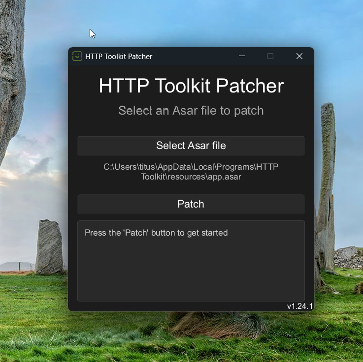

# HTTP Toolkit Patch

A tool designed to patch **HTTP Toolkit** to unlock Pro features.

> [!WARNING]
> **FOR EDUCATIONAL PURPOSES ONLY.**
> This project was created to explore patching, and reverse engineering concepts. It is not intended for piracy or commercial use. If you find HTTP Toolkit useful, please support the original developers by purchasing a legitimate Pro license.

---



## Installation

Download the latest release from the [releases](../../releases) tab.

> [!IMPORTANT]
> I havent included mac os linux binaries in the releases as I have no easy way to build and/or test them. However it should be pretty straightforward to build yourself from source. If any issues occur, feel free to create an issue and I will try to help.

## Usage

1. **Run the app:** Download and run the release file for your operating system (.dmg for macOS, .exe for Windows, or the binary for Linux).
2. **Locate app.asar:** The tool should automatically detect the **HTTP Toolkit** `app.asar` file. If it doesn't, click **Select Path** and navigate to the correct location manually:
   - **Windows (User):** `%LocalAppData%\Programs\httptoolkit\resources\app.asar`
   - **Windows (System):** `C:\Program Files\HTTP Toolkit\resources\app.asar`
   - **macOS:** `/Applications/HTTP Toolkit.app/Contents/Resources/app.asar`
   - **Linux (Debian/Ubuntu):** `/opt/HTTP Toolkit/resources/app.asar`
   - **Linux (Snap):** `/snap/httptoolkit/current/resources/app.asar`

3. **Patch:** Click the **Patch** button. You may be prompted for admin permissions; the tool needs these to close any active HTTP Toolkit processes and modify the file.
4. **Wait:** The process will only take a few seconds.

### Verification

Check the log box for the result:

- ✅ **SUCCESS: PATCH COMPLETED!** – You are good to go.
- ❌ **FAILURE: UNABLE TO PATCH! [Reason]** – The patch failed. Review the reason provided in the log.

---

## Recovery & Troubleshooting

If HTTP Toolkit fails to launch or behaves unexpectedly after patching, a backup is automatically created for your safety.

**To restore the original state:**

1. Navigate to the folder containing your `app.asar` (see paths above).
2. Delete the modified `app.asar`.
3. Rename `app.asar.backup` back to `app.asar`.
4. Restart HTTP Toolkit.

## Building from Source

Ensure you have the latest **Rust Cargo** compiler installed.

```bash
git clone https://github.com/7i7u5/http-toolkit-patch
cd http-toolkit-patch
cargo build --release
```

## How it works

The patch modifies the app.asar file to enable the Chrome DevTools Protocol, which intercepts and alters the main.js script before it loads. This allows us to patch the user object and grant ourselves a premium plan. Because of the nature of this patch, it may need to be reapplied after updates.

## Disclaimer

The author and contributors are not responsible for any misuse of this tool, data loss, or account bans. By using this software, you agree that you are doing so at your own risk.
